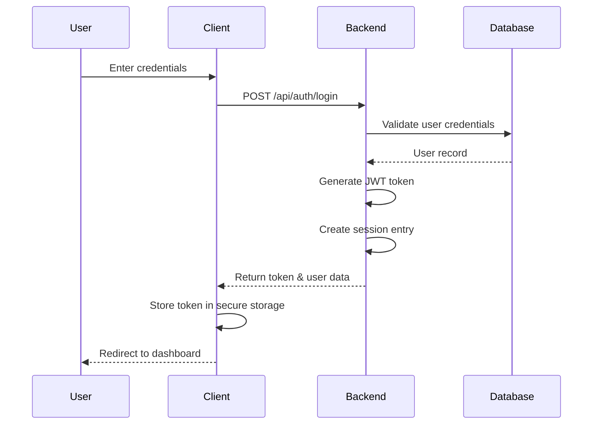
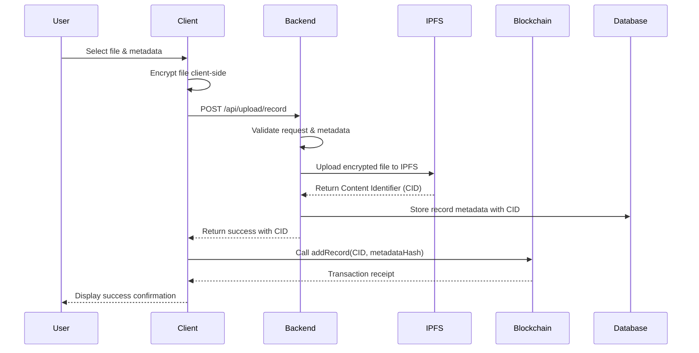
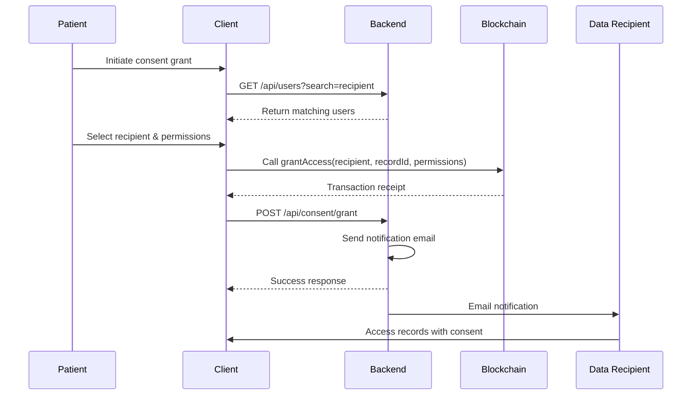
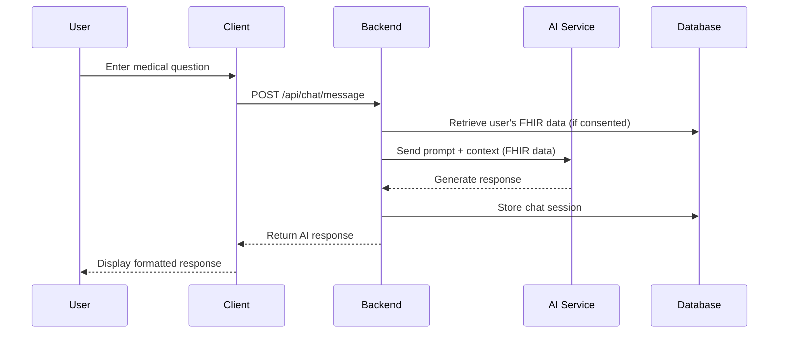

<p align="center">
  
</p>

#  MedChain: A Decentralized Health Data Management Platform


### Table of Contents

- Project Overview
- Architecture
- Repository Layout
- Core Process Flows
- Key Modules & Responsibilities
- API Endpoints
- Environment Variables
- Local Development Setup
- Production Deployment
- Security Considerations
- Development Guidelines
- Troubleshooting
- License

### Project Overview

##### MedChain is a comprehensive decentralized health data management platform that empowers patients with complete control over their medical records. The platform combines cutting-edge technologies to ensure security, privacy, and interoperability:

- Client-Side Encryption: All sensitive health data is encrypted on the client side before leaving the user's device
- IPFS Storage: Encrypted records are stored on the InterPlanetary File System for distributed, resilient storage
- Blockchain Audit Trail: Ethereum smart contracts maintain immutable pointers to records and manage consent logs
- FHIR Compliance: Support for healthcare data standards through FHIR resource mapping
- Clinical AI Assistant: Integrated chatbot for clinical decision support and patient education


### Technology Stack

| Component | Technology |
| --- | --- |
| **Frontend** | React 18 + Vite  + Tailwind CSS |
| **Backend** | Node.js + Express + MongoDB |
| **Blockchain** | Solidity + Hardhat + Ethers.js |
| **Storage** | IPFS (Pinata/Infura)  |
| **Encryption** | AES-256-GCM + Web Crypto API |
| **Authentication**| JWT + Session Management |


### Architecture 

```bash 
┌─────────────────┐    ┌──────────────────┐    ┌─────────────────┐
│   React Client  │◄──►│  Express Server  │◄──►│   MongoDB       │
│                 │    │                  │    │                 │
│ - Wallet Connect│    │ - Auth Routes    │    │ - Users         │
│ - Encryption    │    │ - Upload Gateway │    │ - Sessions      │
│ - UI Components │    │ - IPFS Helper    │    │ - Metadata      │
│ - Contract Int. │    │ - FHIR Utilities │    │                 │
└─────────────────┘    └──────────────────┘    └─────────────────┘
         │                       │                       │
         │                       │                       │
         ▼                       ▼                       ▼
┌─────────────────┐    ┌──────────────────┐    ┌─────────────────┐
│  Ethereum       │    │   IPFS Network   │    │   Email Service │
│  Blockchain     │    │                  │    │                 │
│                 │    │ - File Storage   │    │ - Notifications │
│ - Record Pointers│   │ - Content Addressing│  │ - Alerts       │
│ - Consent Mgmt  │    │ - Pinning Service│    │                 │
│ - Access Logs   │    └──────────────────┘    └─────────────────┘
└─────────────────┘

```


### Repository Layout

```bash

MedChain/
├── client/                          # React frontend application
│   ├── public/
│   │   ├── images/
│   │   │   └── logo.png
│   │   └── index.html
│   ├── src/
│   │   ├── components/              # React components
│   │   │   ├── auth/
│   │   │   │   ├── Login.jsx
│   │   │   │   └── Register.jsx
│   │   │   ├── records/
│   │   │   │   ├── UploadRecord.jsx
│   │   │   │   ├── ViewRecords.jsx
│   │   │   │   └── RecordCard.jsx
│   │   │   ├── consent/
│   │   │   │   ├── GrantConsent.jsx
│   │   │   │   └── ConsentManager.jsx
│   │   │   ├── chat/
│   │   │   │   └── ClinicalChatbot.jsx
│   │   │   └── common/
│   │   │       ├── Header.jsx
│   │   │       ├── Footer.jsx
│   │   │       └── WalletConnect.jsx
│   │   ├── config/                  # Configuration files
│   │   │   ├── contracts.js         # Contract ABIs and addresses
│   │   │   ├── web3.js              # Web3 provider configuration
│   │   │   └── constants.js         # Application constants
│   │   ├── utils/                   # Utility functions
│   │   │   ├── encryption.js        # Client-side encryption
│   │   │   ├── ipfs.js              # IPFS client helpers
│   │   │   ├── fhir.js              # FHIR data helpers
│   │   │   └── validators.js        # Form validation
│   │   ├── hooks/                   # Custom React hooks
│   │   │   ├── useAuth.js
│   │   │   ├── useRecords.js
│   │   │   └── useWeb3.js
│   │   ├── contexts/                # React contexts
│   │   │   ├── AuthContext.js
│   │   │   └── Web3Context.js
│   │   ├── styles/                  # Global styles
│   │   │   └── index.css
│   │   ├── App.jsx
│   │   ├── main.jsx
│   │   └── routes.jsx               # Application routing
│   ├── package.json
│   ├── vite.config.js
│   └── .env.example
├── backend/                         # Node.js Express server
│   ├── controllers/                 # Route controllers
│   │   ├── authController.js        # Authentication logic
│   │   ├── uploadController.js      # File upload processing
│   │   ├── recordController.js      # Record management
│   │   ├── consentController.js     # Consent management
│   │   └── chatController.js        # Chatbot functionality
│   ├── routes/                      # Express routes
│   │   ├── authRoutes.js
│   │   ├── uploadRoutes.js
│   │   ├── recordRoutes.js
│   │   ├── consentRoutes.js
│   │   └── chatRoutes.js
│   ├── models/                      # MongoDB models
│   │   ├── User.js
│   │   ├── Record.js
│   │   ├── Consent.js
│   │   └── Session.js
│   ├── middleware/                  # Express middleware
│   │   ├── auth.js                  # Authentication middleware
│   │   ├── validation.js            # Request validation
│   │   ├── errorHandler.js          # Error handling
│   │   └── rateLimit.js             # Rate limiting
│   ├── utils/                       # Utility modules
│   │   ├── encryption.js            # Server-side encryption helpers
│   │   ├── ipfs.js                  # IPFS pinning service
│   │   ├── fhir.js                  # FHIR mapping and validation
│   │   ├── sendEmail.js             # Email notifications
│   │   ├── sessionManager.js        # Session management
│   │   ├── logger.js                # Application logging
│   │   └── validators.js            # Data validation
│   ├── config/                      # Configuration
│   │   ├── database.js              # MongoDB connection
│   │   ├── ipfs.js                  # IPFS configuration
│   │   └── geminiConfig.js          # AI model configuration
│   ├── tests/                       # Backend tests
│   │   ├── unit/
│   │   └── integration/
│   ├── package.json
│   ├── server.js                    # Application entry point
│   └── .env.example
├── contracts/                       # Smart contracts
│   ├── MedicalRecords.sol           # Main record management contract
│   ├── AccessControl.sol            # Consent management
│   ├── interfaces/                  # Contract interfaces
│   │   └── IMedicalRecords.sol
│   ├── hardhat.config.js            # Hardhat configuration
│   └── package.json
├── scripts/                         # Deployment and utility scripts
│   ├── deploy.js                    # Contract deployment
│   ├── test-contracts.js            # Contract testing
│   └── seed-database.js             # Database seeding
├── images/                           # Documentation
│   ├── arch.png/                        
│   ├── architecture.png/              
│   └── logo.png/                 
└── README.md

```

### Core Process Flows

1. Authentication Flow




#### Detailed Steps:

- User submits login form with email and password
- Client sends encrypted credentials to /api/auth/login
- Backend validates credentials against hashed passwords in MongoDB
- Session manager creates new session with expiration
- JWT token generated containing user ID and role
- Token returned to client and stored in HTTP-only cookie or secure storage
- All subsequent requests include token in Authorization header


2. Record Upload & Publication Flow



#### Detailed Steps:

##### Client-Side Encryption:

- User selects medical record file (PDF, DICOM, etc.)
- Client generates random symmetric key
- File encrypted using AES-256-GCM
- Encryption key wrapped with user's public key

##### Backend Processing:

- Upload controller validates file type and size
- Metadata validated and optionally mapped to FHIR format
- IPFS utility pins file to configured IPFS service
- Record metadata stored in MongoDB with IPFS CID

##### Blockchain Recording:

- Client calls smart contract addRecord function
- Transaction includes IPFS CID and metadata hash
- Contract emits RecordAdded event for off-chain indexing


#### 3. Consent Management Flow



##### Consent Types:

- View Access: Read-only access to record
- Temporal Access: Time-limited access (e.g., specialist consultation)
- Research Access: De-identified data for research
- Emergency Access: Break-glass emergency access


#### 4. Clinical Chatbot Flow



##### AI Integration:

- Uses Google Gemini or OpenAI GPT for medical queries
- FHIR data provides patient context when consented
- Responses include medical disclaimers
- All interactions logged for audit purposes


#### Key Modules & Responsibilities

##### Frontend Modules

client/src/utils/encryption.js
- Purpose: Client-side encryption/decryption utilities

Key Functions:

- generateKeyPair(): Generate RSA key pair for user
- encryptFile(file, publicKey): Encrypt file with symmetric key
- decryptFile(encryptedFile, privateKey): Decrypt file
- wrapKey(key, publicKey): Wrap symmetric key with RSA
- Dependencies: Web Crypto API
- client/src/config/contracts.js
- Purpose: Smart contract interactions

Key Functions:

- getContract(): Initialize contract instance
- addRecord(cid, metadataHash): Store record pointer on-chain
- grantAccess(recipient, recordId, permissions): Grant consent
- getAccessLogs(recordId): Retrieve access history
- Dependencies: Ethers.js, contract ABI

##### Backend Modules

backend/controllers/uploadController.js
- Purpose: Handle medical record uploads and processing

Key Functions:

- uploadRecord(): Main upload endpoint handler
- validateMetadata(): Validate record metadata
- mapToFHIR(): Convert metadata to FHIR format
- storeRecord(): Save record to database
- Dependencies: IPFS utility, FHIR mapper, database models

backend/utils/ipfs.js
- Purpose: IPFS file management

Key Functions:

- addFile(buffer): Add file to IPFS
- pinFile(cid): Pin file to ensure persistence
- getFile(cid): Retrieve file from IPFS
- verifyFile(cid): Verify file existence and integrity
- Dependencies: ipfs-http-client, pinata-sdk

backend/utils/fhir.js
- Purpose: FHIR standard compliance

Key Functions:

- mapToFHIRResource(metadata): Map metadata to FHIR resources
- validateFHIR(resource): Validate FHIR compliance
- bundleResources(): Create FHIR bundles
- extractClinicalData(): Extract data for AI context
- Dependencies: fhir.js library

backend/utils/sessionManager.js
- Purpose: Session management (development)

Key Functions:

- createSession(userId): Create new session
- validateSession(token): Validate session token
- destroySession(token): Remove session
- cleanupExpiredSessions(): Clean up old sessions
- Production Note: Replace with Redis or database sessions

##### Smart Contracts
- contracts/MedicalRecords.sol
- Purpose: Main record management contract

Key Functions:

- addRecord(bytes32 cid, bytes32 metadataHash): Add new record
- grantAccess(address recipient, uint256 recordId, uint8 permissions): Grant access
- revokeAccess(address recipient, uint256 recordId): Revoke access
- logAccess(uint256 recordId, address accessor): Log access attempts

Events:

- RecordAdded: Emitted when new record added
- AccessGranted: Emitted when consent granted
- AccessRevoked: Emitted when consent revoked

#### API Endpoints

- Authentication Endpoints

POST /api/auth/register
Request:
```bash

{
  "email": "user@example.com",
  "password": "securePassword123",
  "name": "John Doe",
  "walletAddress": "0x..."
}

```

Response:

```bash
{
  "success": true,
  "token": "jwt_token_here",
  "user": {
    "id": "user_id",
    "email": "user@example.com",
    "name": "John Doe",
    "walletAddress": "0x..."
  }
}
```


POST /api/auth/login

Request:

```bash
{
  "email": "user@example.com",
  "password": "securePassword123"
}
```

Response: Same as register response

POST /api/auth/logout

Headers: Authorization: Bearer <token>
Response: { "success": true }


-Record Management Endpoints

POST /api/upload/record
Headers: Authorization: Bearer <token>, Content-Type: multipart/form-data

Body:

- file: Encrypted medical record file
- metadata: JSON string containing:
```bash
{
  "title": "Blood Test Results",
  "description": "Complete blood count results",
  "recordType": "lab_result",
  "date": "2024-01-15",
  "encryptionKey": "wrapped_key_data"
}

```

Response:
```bash

{
  "success": true,
  "cid": "QmXYZ...",
  "recordId": "record_id",
  "metadata": { ...processed_metadata }
}
```

GET /api/records
Headers: Authorization: Bearer <token>
Query Params: ?page=1&limit=10&type=lab_result

Response:
```bash
{
  "records": [
    {
      "id": "record_id",
      "cid": "QmXYZ...",
      "title": "Blood Test Results",
      "recordType": "lab_result",
      "date": "2024-01-15",
      "createdAt": "2024-01-15T10:30:00Z"
    }
  ],
  "pagination": {
    "page": 1,
    "limit": 10,
    "total": 45
  }
}
```

GET /api/records/:cid
Headers: Authorization: Bearer <token>
Response: Encrypted file stream


##### Consent Management Endpoints

POST /api/consent/grant
Headers: Authorization: Bearer <token>

Request:
```bash
{
  "recipientEmail": "doctor@hospital.com",
  "recordIds": ["record_id_1", "record_id_2"],
  "permissions": ["view"],
  "expiryDate": "2024-12-31",
  "purpose": "Consultation"
}
```

POST /api/consent/revoke
Headers: Authorization: Bearer <token>

Request:

```bash
{
  "recipientEmail": "doctor@hospital.com",
  "recordIds": ["record_id_1"]
}
```

##### Chat Endpoints

POST /api/chat/message
Headers: Authorization: Bearer <token>

Request:
```bash
{
  "message": "What do my blood test results indicate?",
  "sessionId": "session_id_optional",
  "includeRecords": true
}
```

Response:
```bash
{
  "response": "Based on your recent blood test results...",
  "sessionId": "session_id",
  "timestamp": "2024-01-15T10:30:00Z",
  "disclaimer": "This is AI-generated advice..."
}
```


#### Environment Variables
Backend Environment (.env)

```bash
# Server Configuration
NODE_ENV=development
PORT=5000
CORS_ORIGIN=http://localhost:3000

# Database
MONGODB_URI=mongodb://localhost:27017/medchain
DB_NAME=medchain

# Authentication
JWT_SECRET=your_super_secure_jwt_secret_here
JWT_EXPIRES_IN=7d
BCRYPT_ROUNDS=12

# IPFS Configuration
IPFS_HOST=ipfs.infura.io
IPFS_PORT=5001
IPFS_PROTOCOL=https
PINATA_API_KEY=your_pinata_api_key
PINATA_SECRET_API_KEY=your_pinata_secret

# Email Service (Notifications)
EMAIL_HOST=smtp.gmail.com
EMAIL_PORT=587
EMAIL_USER=your_email@gmail.com
EMAIL_PASS=your_app_password
EMAIL_FROM=noreply@medchain.com

# AI Services
GEMINI_API_KEY=your_gemini_api_key
OPENAI_API_KEY=your_openai_api_key

# Blockchain
WEB3_PROVIDER_URL=https://mainnet.infura.io/v3/your_infura_key
CONTRACT_ADDRESS=0xYourDeployedContractAddress

# Security
RATE_LIMIT_WINDOW=900000
RATE_LIMIT_MAX=100
ENCRYPTION_KEY=your_encryption_key_for_server_data
```

Frontend Environment (.env)

```bash
# API Configuration
VITE_API_BASE_URL=http://localhost:5000/api
VITE_WS_URL=ws://localhost:5000

# Blockchain Configuration
VITE_CONTRACT_ADDRESS=0xYourDeployedContractAddress
VITE_NETWORK_RPC=https://sepolia.infura.io/v3/your_infura_key
VITE_CHAIN_ID=11155111
VITE_NETWORK_NAME=sepolia

# Feature Flags
VITE_ENABLE_CHAT=true
VITE_ENABLE_FHIR=true
VITE_DEBUG_MODE=false

# External Services
VITE_IPFS_GATEWAY=https://ipfs.io/ipfs/
VITE_BLOCK_EXPLORER=https://sepolia.etherscan.io
```


#### 🚀 Local Development Setup

##### Prerequisites

* Node.js 18.x or later
* MongoDB 4.4 or later
* Git
* MetaMask or similar Web3 wallet

##### Windows Setup Instructions

##### 1. Clone and Initialize Repository

```bash
# Clone the repository
git clone [https://github.com/aaradhayasingh811/medchain.git](https://github.com/aaradhayasingh811/medchain.git)
cd e:\Medchain

# Install root dependencies (if any)
npm install

```

##### 2. Backend Setup

```bash
# Navigate to backend directory
cd backend

# Install dependencies
npm install

# Set up environment configuration
copy .env.example .env

# Edit .env with your configuration values

# Start MongoDB service (Windows)
net start MongoDB

# Start the development server
npm run dev
```

##### 3. Frontend Setup

```bash
# Navigate to client directory (new terminal)
cd ..\client

# Install dependencies
npm install

# Set up environment configuration
copy .env.example .env

# Edit .env with your configuration values

# Start the development server
npm run dev

```

##### 4. Smart Contract Deployment

```bash
# Navigate to contracts directory
cd ..\contracts

# Install dependencies
npm install

# Compile contracts
npx hardhat compile

# Deploy to local network
npx hardhat run scripts/deploy.js --network localhost

# Update client configuration with deployed contract address
```

##### Verification Steps
- Backend Health Check: Visit http://localhost:5000/api/health
- Frontend Load: Visit http://localhost:3000
- Database Connection: Check MongoDB logs for connections
- Contract Verification: Use Hardhat console to verify contract functions


#### Security Considerations

#### Critical Security Measures

##### Client-Side Encryption

- Always encrypt sensitive data before upload
- Never transmit encryption keys with data
- Use strong, randomly generated keys

##### Access Controls

- Implement principle of least privilege
- Regular audit of access logs
- Time-bound consent grants

##### Data Protection

- Secure key management
- Regular security audits
- Penetration testing

##### Compliance

- HIPAA compliance for US healthcare data
- GDPR compliance for European users
- Local healthcare regulations

##### Security Audit Checklist

- All sensitive data encrypted at rest and in transit
- Client-side encryption implemented correctly
- Access controls tested and verified
- Smart contracts audited by third party
- Regular security dependency updates
- Incident response plan in place

#### Performance Optimization

##### Frontend

- Code splitting with React.lazy()
- Image optimization and lazy loading
- Bundle analysis with webpack-bundle-analyzer

##### Backend

- Database indexing optimization
- API response caching
- Connection pooling

##### Blockchain

- Gas optimization in contracts
- Batch operations where possible
- Event-based architecture

##### Troubleshooting

- Common Issues
###### Connection Issues
- Problem: Frontend cannot connect to backend
- Solution:

- Verify CORS configuration
- Check backend is running on correct port
- Verify environment variables

###### IPFS Upload Failures
- Problem: Files failing to upload to IPFS
- Solution:

- Check Pinata API credentials
- Verify file size limits
- Check network connectivity

###### Blockchain Transactions Failing
- Problem: MetaMask transactions failing
- Solution:

- Verify correct network selection
- Check gas limits
- Verify contract ABI matches deployed contract

###### Database Connection Issues
- Problem: MongoDB connection failures
- Solution:

- Verify MongoDB service is running
- Check connection string in environment variables
- Verify network permissions

#### License

- This project is licensed under the MIT License - see the LICENSE file for details.

---------

<p align="center"> <em>Built with ❤️ for better healthcare data management</em> </p>
